# 📚 Tawk Agents SDK - Documentation

**Complete guide to building production-ready AI agents**

Welcome to the Tawk Agents SDK documentation! This guide will take you from your first agent to production-ready multi-agent systems with full observability.

---

## 🎯 Quick Navigation

**Just starting?** → [Getting Started](#getting-started)  
**Need a specific feature?** → [Feature Guides](#feature-guides)  
**Building something complex?** → [Architecture Guide](#architecture)  
**API reference?** → [API Documentation](#api-reference)

---

## 📖 Documentation Structure

### 🚀 Getting Started

**Start here if you're new to the SDK**

1. **[Getting Started Guide](./getting-started/GETTING_STARTED.md)** `[15 min]`
   - Installation & setup
   - Your first agent
   - Basic tool calling
   - Simple multi-agent system
   
   ```mermaid
   graph LR
       A[Install SDK] --> B[Create Agent]
       B --> C[Add Tools]
       C --> D[Run Agent]
       D --> E[Production Ready]
   ```

---

### 🎓 Core Concepts

**Understand the fundamentals**

2. **[Core Concepts](./guides/CORE_CONCEPTS.md)** `[20 min]`
   - What is an agent?
   - True agentic architecture
   - Tool execution model
   - Agent lifecycle
   - State management
   
   **Key Diagrams**:
   - 🔄 Agent execution flow
   - 🔧 Tool calling mechanism
   - 👥 Multi-agent coordination
   - 📊 State transitions

---

### 🛠️ Feature Guides

**Learn specific features in-depth**

#### Essential Features

3. **[Features Overview](./guides/FEATURES.md)** `[30 min]`
   - All features at a glance
   - When to use what
   - Feature comparison matrix
   - Quick reference

4. **[Tool Calling & Execution](./guides/FEATURES.md#tool-calling)** `[15 min]`
   - Creating tools
   - Parallel execution
   - Tool contexts
   - Error handling

5. **[Multi-Agent Systems](./guides/FEATURES.md#multi-agent)** `[20 min]`
   - Agent handoffs
   - Coordination patterns
   - Race agents
   - Agent specialization

6. **[Guardrails & Safety](./guides/FEATURES.md#guardrails)** `[15 min]`
   - Built-in guardrails
   - Custom guardrails
   - PII detection
   - Content safety

#### Advanced Features

7. **[Advanced Features](./guides/ADVANCED_FEATURES.md)** `[45 min]`
   - Message helpers
   - Lifecycle hooks
   - Advanced tracing
   - Safe execution
   - Background results
   - RunState management
   - TypeScript utilities

8. **[Human-in-the-Loop (HITL)](./guides/HUMAN_IN_THE_LOOP.md)** `[20 min]`
   - Approval workflows
   - Dynamic approvals
   - Approval policies
   - Integration patterns

9. **[Tracing & Observability](./guides/TRACING.md)** `[15 min]`
   - Langfuse integration
   - Custom tracing
   - Performance monitoring
   - Debugging agents

#### Specialized Guides

10. **[Agentic RAG](./guides/AGENTIC_RAG.md)** `[30 min]`
    - RAG architecture
    - Vector databases
    - Query optimization
    - Production patterns

11. **[TOON Optimization](./guides/TOON_OPTIMIZATION.md)** `[15 min]`
    - Token reduction (42%)
    - When to use TOON
    - Performance gains
    - Best practices

12. **[Error Handling](./guides/ERROR_HANDLING.md)** `[15 min]`
    - Error types
    - Recovery strategies
    - Retry patterns
    - Production tips

13. **[Lifecycle Hooks](./guides/LIFECYCLE_HOOKS.md)** `[15 min]`
    - Hook types
    - Custom logic
    - Monitoring
    - Debugging

---

### 🏗️ Architecture

**Deep technical understanding**

14. **[Architecture Overview](./reference/ARCHITECTURE.md)** `[45 min]`
    - System architecture
    - Component design
   - Data flow
    - Design decisions
    
    **Complete Diagrams**:
    - 🏛️ High-level architecture
    - 🔄 Execution engine
    - 💾 State management
    - 🔌 Integration points

15. **[Performance Guide](./reference/PERFORMANCE.md)** `[30 min]`
    - Performance optimization
    - Benchmarks
   - Best practices
    - Monitoring

---

### 📘 API Reference

**Complete API documentation**

16. **[API Documentation](./reference/API.md)** `[Reference]`
    - All classes & functions
    - Type definitions
    - Parameters & returns
    - Usage examples

---

## 🗺️ Learning Paths

### Path 1: Beginner → Production

**Timeline: 2-3 hours**


1. Read [Getting Started](./getting-started/GETTING_STARTED.md) `[15 min]`
2. Understand [Core Concepts](./guides/CORE_CONCEPTS.md) `[20 min]`
3. Review [Features Overview](./guides/FEATURES.md) `[30 min]`
4. Practice [Tool Calling](./guides/FEATURES.md#tool-calling) `[15 min]`
5. Build [Multi-Agent System](./guides/FEATURES.md#multi-agent) `[20 min]`
6. Add [Guardrails](./guides/FEATURES.md#guardrails) `[15 min]`
7. Enable [Tracing](./guides/TRACING.md) `[15 min]`

**Result**: Production-ready agent system with observability ✅

---

### Path 2: Advanced Developer

**Timeline: 4-5 hours**


1. Master [Core Concepts](./guides/CORE_CONCEPTS.md) `[20 min]`
2. Study [Architecture](./reference/ARCHITECTURE.md) `[45 min]`
3. Explore [Advanced Features](./guides/ADVANCED_FEATURES.md) `[45 min]`
4. Implement [HITL](./guides/HUMAN_IN_THE_LOOP.md) `[20 min]`
5. Setup [Custom Tracing](./guides/TRACING.md) `[15 min]`
6. Build [RAG System](./guides/AGENTIC_RAG.md) `[30 min]`
7. Optimize [Performance](./reference/PERFORMANCE.md) `[30 min]`

**Result**: Expert-level agent development with custom patterns ✅

---

### Path 3: Production Engineer

**Timeline: 3-4 hours**


1. Understand [Architecture](./reference/ARCHITECTURE.md) `[45 min]`
2. Optimize [Performance](./reference/PERFORMANCE.md) `[30 min]`
3. Master [Error Handling](./guides/ERROR_HANDLING.md) `[15 min]`
4. Setup [Tracing](./guides/TRACING.md) `[15 min]`
5. Implement [HITL Safety](./guides/HUMAN_IN_THE_LOOP.md) `[20 min]`
6. Study [TOON Optimization](./guides/TOON_OPTIMIZATION.md) `[15 min]`

**Result**: Production-grade deployment expertise ✅

---

## 🎨 Key Architecture Diagrams

### 1. System Architecture


### 2. Agent Execution Flow

```mermaid
sequenceDiagram
    participant User
    participant Agent
    participant Tools
    participant AI Model
    participant Guardrails
    
    User->>Agent: run(input)
    Agent->>Guardrails: Validate input
    Guardrails-->>Agent: ✓ Pass
    
    Agent->>AI Model: Process with tools
    AI Model-->>Agent: Tool calls needed
    
    Agent->>Tools: Execute in parallel
    Tools-->>Agent: Results
    
    Agent->>AI Model: Continue with results
    AI Model-->>Agent: Final response
    
    Agent->>Guardrails: Validate output
    Guardrails-->>Agent: ✓ Pass
    
    Agent-->>User: Final output
```



### 3. Multi-Agent Coordination


---

## 📚 Document Index

### By Topic

**Core**
- [Getting Started](./getting-started/GETTING_STARTED.md)
- [Core Concepts](./guides/CORE_CONCEPTS.md)
- [Features](./guides/FEATURES.md)
- [API Reference](./reference/API.md)

**Advanced**
- [Advanced Features](./guides/ADVANCED_FEATURES.md)
- [Architecture](./reference/ARCHITECTURE.md)
- [Performance](./reference/PERFORMANCE.md)

**Patterns**
- [Agentic RAG](./guides/AGENTIC_RAG.md)
- [Multi-Agent](./guides/FEATURES.md#multi-agent)
- [Error Handling](./guides/ERROR_HANDLING.md)

**Safety & Monitoring**
- [Guardrails](./guides/FEATURES.md#guardrails)
- [HITL](./guides/HUMAN_IN_THE_LOOP.md)
- [Tracing](./guides/TRACING.md)

**Optimization**
- [TOON Format](./guides/TOON_OPTIMIZATION.md)
- [Performance](./reference/PERFORMANCE.md)
- [Lifecycle Hooks](./guides/LIFECYCLE_HOOKS.md)

### By Reading Time

**Quick (< 15 min)**
- [TOON Optimization](./guides/TOON_OPTIMIZATION.md) - 15 min
- [Error Handling](./guides/ERROR_HANDLING.md) - 15 min
- [Lifecycle Hooks](./guides/LIFECYCLE_HOOKS.md) - 15 min
- [Tracing](./guides/TRACING.md) - 15 min

**Medium (15-30 min)**
- [Getting Started](./getting-started/GETTING_STARTED.md) - 15 min
- [Core Concepts](./guides/CORE_CONCEPTS.md) - 20 min
- [HITL](./guides/HUMAN_IN_THE_LOOP.md) - 20 min
- [Features](./guides/FEATURES.md) - 30 min
- [Agentic RAG](./guides/AGENTIC_RAG.md) - 30 min
- [Performance](./reference/PERFORMANCE.md) - 30 min

**Deep Dive (> 30 min)**
- [Advanced Features](./guides/ADVANCED_FEATURES.md) - 45 min
- [Architecture](./reference/ARCHITECTURE.md) - 45 min
- [API Reference](./reference/API.md) - Reference

---

## 🔍 Finding What You Need

### "I want to..."

**Build my first agent**
→ [Getting Started](./getting-started/GETTING_STARTED.md)

**Understand how it works**
→ [Core Concepts](./guides/CORE_CONCEPTS.md)

**Add tools to my agent**
→ [Tool Calling](./guides/FEATURES.md#tool-calling)

**Create a multi-agent system**
→ [Multi-Agent Guide](./guides/FEATURES.md#multi-agent)

**Make my agent safer**
→ [Guardrails](./guides/FEATURES.md#guardrails)

**Monitor my agents**
→ [Tracing & Observability](./guides/TRACING.md)

**Optimize performance**
→ [Performance Guide](./reference/PERFORMANCE.md)

**Build a RAG system**
→ [Agentic RAG](./guides/AGENTIC_RAG.md)

**Add human approval**
→ [Human-in-the-Loop](./guides/HUMAN_IN_THE_LOOP.md)

**Reduce token usage**
→ [TOON Optimization](./guides/TOON_OPTIMIZATION.md)

**Handle errors gracefully**
→ [Error Handling](./guides/ERROR_HANDLING.md)

**Deep dive into architecture**
→ [Architecture Guide](./reference/ARCHITECTURE.md)

**API reference**
→ [API Documentation](./reference/API.md)

---

## 💡 Best Practices

### Reading Order Recommendations

**First Time Users** (2-3 hours):
1. Getting Started → Core Concepts → Features → Tool Calling → Multi-Agent

**Experienced Developers** (4-5 hours):
1. Core Concepts → Architecture → Advanced Features → HITL → RAG

**Production Engineers** (3-4 hours):
1. Architecture → Performance → Error Handling → Tracing → TOON

**Quick Reference**:
- Use API Documentation for function signatures
- Use Features guide for feature overview
- Use examples/ directory for working code

---

## 🆘 Getting Help

- 📧 **Email**: support@tawk.to
- 🐛 **Issues**: [GitHub Issues](https://github.com/Manoj-tawk/tawk-agents-sdk/issues)
- 💬 **Community**: Coming soon
- 📖 **Examples**: [examples/](../examples)

---

## 🔄 Documentation Updates

This documentation is actively maintained. Last updated: December 1, 2025

Found an issue or have a suggestion? Please [open an issue](https://github.com/Manoj-tawk/tawk-agents-sdk/issues).

---

**Ready to start?** Begin with [Getting Started](./getting-started/GETTING_STARTED.md) →

**Made with ❤️ by [Tawk.to](https://www.tawk.to)**
