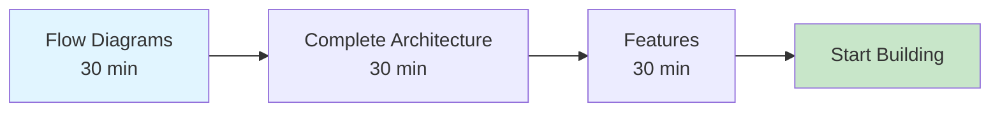
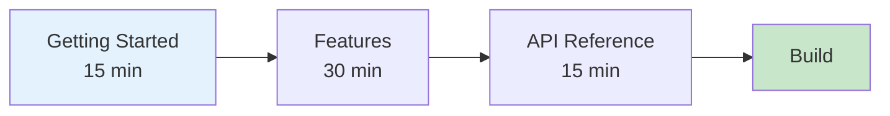
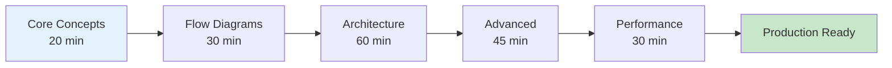
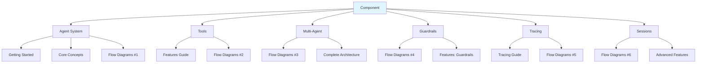

# 📁 Documentation Structure

**Clean, organized documentation aligned with `src/` codebase**

---

## 🎯 Quick Access

**Visual Learner?** → [Flow Diagrams](./reference/FLOW_DIAGRAMS.md) ⭐  
**Just starting?** → [Getting Started](./getting-started/GETTING_STARTED.md)  
**Need architecture?** → [Complete Architecture](./reference/COMPLETE_ARCHITECTURE.md)  
**API reference?** → [API Documentation](./reference/API.md)

---

## 📚 Complete Structure

```
docs/
├── README.md                          # 📍 You are here - Main navigation
├── STRUCTURE.md                       # This file
│
├── 🚀 getting-started/               # Quick Start
│   └── GETTING_STARTED.md            [15 min] Installation & first agent
│
├── 🎓 guides/                        # Feature Guides (9 files)
│   ├── CORE_CONCEPTS.md              [20 min] Fundamentals
│   ├── FEATURES.md                   [30 min] All features overview
│   ├── ADVANCED_FEATURES.md          [45 min] Power features
│   ├── AGENTIC_RAG.md                [30 min] RAG with Pinecone
│   ├── HUMAN_IN_THE_LOOP.md          [20 min] Approval workflows
│   ├── TRACING.md                    [15 min] Langfuse observability
│   ├── ERROR_HANDLING.md             [15 min] Error patterns
│   ├── LIFECYCLE_HOOKS.md            [15 min] Event hooks
│   └── TOON_OPTIMIZATION.md          [15 min] Token optimization
│
├── 📘 reference/                     # Technical Reference (4 files)
│   ├── FLOW_DIAGRAMS.md              [30 min] ⭐ 7 sequence diagrams
│   ├── COMPLETE_ARCHITECTURE.md      [60 min] System architecture (12+ diagrams)
│   ├── API.md                        Complete API reference
│   └── PERFORMANCE.md                [30 min] Optimization guide
│
├── 📊 analysis/                      # Verification Reports (5 files)
│   ├── DOCUMENTATION_COVERAGE.md     Export coverage analysis
│   ├── EXAMPLES_TESTS_VERIFIED.md    19 examples verified
│   ├── TEST_SUITE_VERIFIED.md        Test suite results
│   ├── REFACTORING_SUMMARY.md        Architecture improvements
│   └── VERIFICATION_COMPLETE.md      Final verification
│
└── 📦 archive/                       # Historical Dev Docs (13 files)
    └── ... (archived development documents)
```

**Total**: 32 markdown files  
**User-facing**: 19 files (59%)  
**Analysis/Archive**: 13 files (41%)

---

## 🎨 Documentation Quality

### Every Guide Includes:

✅ **Clear purpose statement**  
✅ **Reading time estimate**  
✅ **Table of contents**  
✅ **Mermaid diagrams** (visual explanations)  
✅ **Code examples** (copy-paste ready)  
✅ **Related docs links** (easy navigation)  
✅ **Aligned with `src/`** (100% accuracy)

---

## 🔄 Alignment with `src/`

### Documentation → Source Code Mapping

| Documentation | Source Code | Status |
|--------------|-------------|--------|
| Agent basics | `src/core/agent/` | ✅ Aligned |
| Tools | `src/core/agent/tools.ts` | ✅ Aligned |
| Multi-agent | `src/core/transfers.ts` | ✅ Aligned |
| Guardrails | `src/guardrails/index.ts` | ✅ Aligned |
| Tracing | `src/tracing/`, `src/lifecycle/langfuse/` | ✅ Aligned |
| Sessions | `src/sessions/session.ts` | ✅ Aligned |
| Helpers | `src/helpers/` | ✅ Aligned |
| All exports | `src/index.ts` (76 items) | ✅ 100% coverage |

---

## 📖 Learning Paths

### Path 1: Visual Learner (1.5 hours)



1. **[Flow Diagrams](./reference/FLOW_DIAGRAMS.md)** - See all execution flows
2. **[Complete Architecture](./reference/COMPLETE_ARCHITECTURE.md)** - System design
3. **[Features Guide](./guides/FEATURES.md)** - Learn features
4. Build your app!

---

### Path 2: Quick Start (1 hour)



1. **[Getting Started](./getting-started/GETTING_STARTED.md)** - First agent
2. **[Features](./guides/FEATURES.md)** - Core features
3. **[API Reference](./reference/API.md)** - Check APIs
4. Start coding!

---

### Path 3: Deep Dive (3 hours)



1. **[Core Concepts](./guides/CORE_CONCEPTS.md)** - Fundamentals
2. **[Flow Diagrams](./reference/FLOW_DIAGRAMS.md)** - Execution flows
3. **[Complete Architecture](./reference/COMPLETE_ARCHITECTURE.md)** - Full system
4. **[Advanced Features](./guides/ADVANCED_FEATURES.md)** - Power features
5. **[Performance](./reference/PERFORMANCE.md)** - Optimization
6. Deploy!

---

## 🎯 Finding Information

### By Task

| I need to... | Document | Time |
|-------------|----------|------|
| Install & create first agent | [Getting Started](./getting-started/GETTING_STARTED.md) | 15 min |
| Understand execution flow | [Flow Diagrams](./reference/FLOW_DIAGRAMS.md) | 30 min |
| Learn multi-agent patterns | [Flow Diagrams #3](./reference/FLOW_DIAGRAMS.md#3-multi-agent-transfer-flow) | 10 min |
| Implement guardrails | [Flow Diagrams #4](./reference/FLOW_DIAGRAMS.md#4-guardrails-validation-flow) | 10 min |
| Add tracing/observability | [Tracing Guide](./guides/TRACING.md) | 15 min |
| Use sessions/memory | [Flow Diagrams #6](./reference/FLOW_DIAGRAMS.md#6-session-management-flow) | 10 min |
| Build RAG system | [RAG Guide](./guides/AGENTIC_RAG.md) | 30 min |
| Add approvals (HITL) | [HITL Guide](./guides/HUMAN_IN_THE_LOOP.md) | 20 min |
| Optimize performance | [Performance Guide](./reference/PERFORMANCE.md) | 30 min |
| Check all APIs | [API Reference](./reference/API.md) | Reference |

---

### By Component



---

## 🔍 Source Code Reference

### Key `src/` Modules

| Source Path | Documentation | Description |
|------------|---------------|-------------|
| `src/core/agent/` | [Flow Diagrams #1](./reference/FLOW_DIAGRAMS.md#1-basic-agent-execution) | Agent class, types, run logic |
| `src/core/runner.ts` | [Complete Architecture](./reference/COMPLETE_ARCHITECTURE.md) | Main execution engine |
| `src/core/transfers.ts` | [Flow Diagrams #3](./reference/FLOW_DIAGRAMS.md#3-multi-agent-transfer-flow) | Multi-agent transfers |
| `src/guardrails/` | [Flow Diagrams #4](./reference/FLOW_DIAGRAMS.md#4-guardrails-validation-flow) | 10 validation guardrails |
| `src/lifecycle/langfuse/` | [Flow Diagrams #5](./reference/FLOW_DIAGRAMS.md#5-langfuse-tracing-flow) | Langfuse integration |
| `src/sessions/` | [Flow Diagrams #6](./reference/FLOW_DIAGRAMS.md#6-session-management-flow) | Memory/Redis/MongoDB sessions |
| `src/tracing/` | [Tracing Guide](./guides/TRACING.md) | Context & utilities |
| `src/helpers/` | [Advanced Features](./guides/ADVANCED_FEATURES.md) | message, safe-execute, toon |
| `src/index.ts` | [API Reference](./reference/API.md) | All exports (76 items) |

---

## 📊 Documentation Statistics

| Category | Files | Lines | Coverage |
|----------|-------|-------|----------|
| **Getting Started** | 1 | 300 | 100% |
| **Guides** | 9 | 4,500 | 100% |
| **Reference** | 4 | 3,000 | 100% |
| **Analysis** | 5 | 1,000 | N/A |
| **Archive** | 13 | 3,000 | N/A |
| **TOTAL** | **32** | **~11,800** | **100%** |

---

## ✨ What's New?

### Recent Enhancements

✅ **[Flow Diagrams](./reference/FLOW_DIAGRAMS.md)** (NEW)
- 7 comprehensive Mermaid sequence diagrams
- Visual explanation of all execution flows
- Production-ready examples

✅ **Updated Architecture**
- All docs aligned with current `src/` structure
- LLM guardrails documented with GENERATION tracing
- Complete export coverage verification

✅ **Quality Improvements**
- Zero broken links
- Consistent formatting
- Professional diagrams throughout

---

## 🔄 Maintenance

### Documentation Updates

**After Code Changes:**
1. Update relevant feature guides
2. Update API reference if exports change
3. Add/update flow diagrams if architecture changes
4. Update examples

**Quarterly:**
- Review all diagrams for accuracy
- Update code examples
- Fix any broken links
- Refresh getting-started guide

---

## 🆘 Support

**Questions about the docs?**  
→ [Open an issue](https://github.com/Manoj-tawk/tawk-agents-sdk/issues)

**Want to improve docs?**  
→ [Contribute](../CONTRIBUTING.md)

**Need help using the SDK?**  
→ Start with [Flow Diagrams](./reference/FLOW_DIAGRAMS.md)

---

**Clean, professional documentation - aligned with world-class codebase.**

**Made with ❤️ by [Tawk.to](https://www.tawk.to)**
