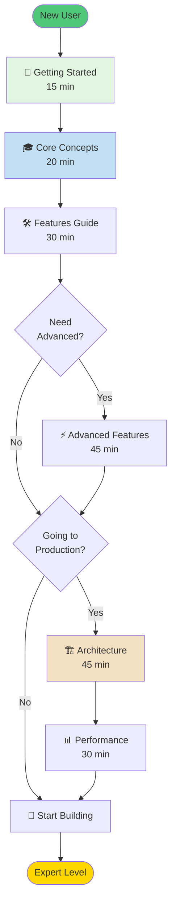
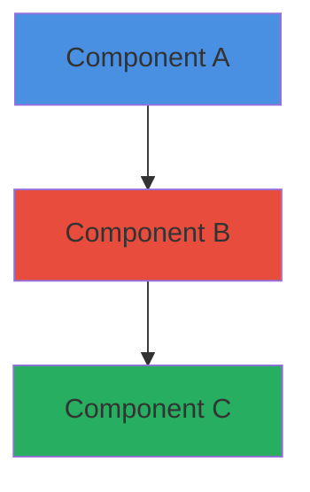

# 📁 Documentation Structure

**Organization and flow of Tawk Agents SDK documentation**

---

## 🎯 Learning Flow



---

## 📚 Directory Structure

```
docs/
├── README.md                          # Main navigation & learning paths
├── STRUCTURE.md                       # This file
│
├── getting-started/
│   └── GETTING_STARTED.md            # 15 min tutorial
│
├── guides/                            # Feature-specific guides
│   ├── CORE_CONCEPTS.md              # 20 min - Fundamentals
│   ├── FEATURES.md                   # 30 min - All features
│   ├── ADVANCED_FEATURES.md          # 45 min - Power features
│   ├── AGENTIC_RAG.md                # 30 min - RAG systems
│   ├── HUMAN_IN_THE_LOOP.md          # 20 min - HITL patterns
│   ├── TRACING.md                    # 15 min - Observability
│   ├── ERROR_HANDLING.md             # 15 min - Error patterns
│   ├── LIFECYCLE_HOOKS.md            # 15 min - Hooks system
│   └── TOON_OPTIMIZATION.md          # 15 min - Token optimization
│
├── reference/                         # Technical references
│   ├── API.md                        # Complete API reference
│   ├── ARCHITECTURE.md               # 45 min - System architecture
│   └── PERFORMANCE.md                # 30 min - Optimization guide
│
├── development/                       # Development docs
│   ├── ARCHITECTURE.md               # Agentic architecture details
│   ├── FEATURES_IMPLEMENTED.md       # Feature implementation notes
│   ├── TESTING_GUIDE.md              # Testing strategies
│   ├── TEST_SUITE_SUMMARY.md         # Test results
│   ├── TOOL_TRACING_COMPLETE.md      # Tracing implementation
│   └── TRACING_ANALYSIS.md           # Tracing analysis
│
└── archive/                           # Historical documents
    ├── AGENTIC_IMPLEMENTATION_REVIEW.md
    ├── BEFORE_AFTER_COMPARISON.md
    ├── COMPREHENSIVE_GAP_ANALYSIS.md
    └── ... (13 archived docs)
```

---

## 📖 Document Categories

### 🚀 Getting Started (1 doc, 15 min)
**Purpose**: Get users from zero to their first working agent

- **GETTING_STARTED.md** - Step-by-step tutorial
  - Installation
  - First agent
  - Tool calling
  - Multi-agent basics

---

### 🎓 Core Guides (9 docs, 3-4 hours total)
**Purpose**: Comprehensive feature documentation

**Essential** (3 docs, 1h 10min):
- **CORE_CONCEPTS.md** (20 min) - Architecture fundamentals with diagrams
- **FEATURES.md** (30 min) - All features overview
- **ADVANCED_FEATURES.md** (45 min) - Power user features

**Specialized** (6 docs, 2h):
- **AGENTIC_RAG.md** (30 min) - RAG systems
- **HUMAN_IN_THE_LOOP.md** (20 min) - Approval workflows
- **TRACING.md** (15 min) - Observability
- **ERROR_HANDLING.md** (15 min) - Error patterns
- **LIFECYCLE_HOOKS.md** (15 min) - Event hooks
- **TOON_OPTIMIZATION.md** (15 min) - Token reduction

---

### 📘 Technical Reference (3 docs)
**Purpose**: Deep technical documentation

- **API.md** - Complete API reference (lookup)
- **ARCHITECTURE.md** (45 min) - System architecture with detailed diagrams
- **PERFORMANCE.md** (30 min) - Optimization strategies

---

### 🔧 Development (6 docs)
**Purpose**: Internal development documentation

- Architecture implementation details
- Feature implementation notes
- Testing strategies and results
- Tracing implementation analysis

---

### 📦 Archive (13 docs)
**Purpose**: Historical analysis and gap comparisons

- Implementation reviews
- Gap analyses
- Before/after comparisons
- Development journey

---

## 🎯 Document Features

### Every Guide Includes:

✅ **Clear Purpose Statement**  
✅ **Table of Contents**  
✅ **Mermaid Diagrams** (where applicable)  
✅ **Code Examples**  
✅ **Reading Time Estimate**  
✅ **Related Documentation Links**  
✅ **Next Steps**  

### Architecture Diagrams Use:



**Color Scheme**:
- 🔵 Blue (#4a90e2) - Core components
- 🔴 Red (#e74c3c) - Execution/processing
- 🟠 Orange (#f39c12) - State/storage
- 🟢 Green (#27ae60) - Tools/external
- 🟣 Purple (#9b59b6) - Safety/validation
- ✅ Light Green (#50c878) - Start/success
- 🟡 Gold (#ffd700) - End/completion

---

## 🔍 Finding Documents

### By User Type

**Beginner Developer**:
1. README.md → Learning Path 1
2. getting-started/GETTING_STARTED.md
3. guides/CORE_CONCEPTS.md
4. guides/FEATURES.md

**Experienced Developer**:
1. README.md → Learning Path 2
2. guides/CORE_CONCEPTS.md
3. reference/ARCHITECTURE.md
4. guides/ADVANCED_FEATURES.md

**Production Engineer**:
1. README.md → Learning Path 3
2. reference/ARCHITECTURE.md
3. reference/PERFORMANCE.md
4. guides/ERROR_HANDLING.md

### By Need

**"I want to learn..."**
→ `getting-started/` → `guides/CORE_CONCEPTS.md`

**"I need a feature..."**
→ `guides/FEATURES.md` or specific guide

**"How does it work?"**
→ `reference/ARCHITECTURE.md`

**"API reference?"**
→ `reference/API.md`

**"Production tips?"**
→ `reference/PERFORMANCE.md`, `guides/ERROR_HANDLING.md`

---

## 📊 Documentation Statistics

| Category | Files | Total Time | Diagrams |
|----------|-------|------------|----------|
| **Getting Started** | 1 | 15 min | 2 |
| **Core Guides** | 9 | ~240 min | 15+ |
| **Reference** | 3 | ~75 min | 20+ |
| **Development** | 6 | N/A | 5 |
| **Archive** | 13 | N/A | 0 |
| **TOTAL** | **32** | **~5.5 hours** | **40+** |

---

## ✅ Quality Standards

### Every Document Must Have:

1. **Clear Title & Purpose**
   - What is this doc about?
   - Who is it for?
   - Expected reading time

2. **Table of Contents**
   - For docs > 200 lines
   - Clickable links

3. **Visual Aids**
   - Mermaid diagrams for architecture
   - Code examples for implementation
   - Sequence diagrams for flows

4. **Code Examples**
   - Real, working code
   - With context
   - Commented when complex

5. **Navigation**
   - Links to related docs
   - Next steps
   - Back to main README

6. **Consistency**
   - Same heading structure
   - Same code style
   - Same terminology

---

## 🔄 Maintenance

### Regular Updates

**Quarterly**:
- Review all getting-started docs
- Update code examples
- Fix broken links

**Per Release**:
- Update CHANGELOG
- Update API reference
- Add new feature docs

**As Needed**:
- Fix reported issues
- Clarify confusing sections
- Add missing diagrams

---

## 🆘 Documentation Issues?

**Found an issue?**
→ [Open an issue](https://github.com/Manoj-tawk/tawk-agents-sdk/issues)

**Want to contribute?**
→ See [CONTRIBUTING.md](../../CONTRIBUTING.md)

**Need clarification?**
→ Email support@tawk.to

---

## 🎨 Diagram Guidelines

### Mermaid Diagram Types

**System Architecture**: `graph TB` (top to bottom)
**Data Flow**: `graph LR` (left to right)
**Sequence**: `sequenceDiagram`
**State Machine**: `stateDiagram-v2`
**Class Diagram**: `classDiagram`
**Flow Chart**: `flowchart TD`

### Best Practices

✅ Use consistent colors
✅ Label all relationships
✅ Keep diagrams focused (1 concept)
✅ Add legends for complex diagrams
✅ Use subgraphs for grouping

---

**This documentation structure is designed for progressive learning from beginner to expert.**

**Made with ❤️ by [Tawk.to](https://www.tawk.to)**
