# 🎓 Core Concepts

**Understanding the fundamentals of Tawk Agents SDK**

This guide explains the core architecture and concepts that power the SDK. By the end, you'll understand how agents work, how they execute tools, and how to build complex systems.

---

## 📖 Table of Contents

1. [What is an Agent?](#what-is-an-agent)
2. [True Agentic Architecture](#true-agentic-architecture)
3. [Tool Execution](#tool-execution)
4. [Multi-Agent Systems](#multi-agent-systems)
5. [State Management](#state-management)
6. [Execution Lifecycle](#execution-lifecycle)

---

## 1. What is an Agent?

### Definition

An **Agent** is an autonomous AI entity with:
- **Intelligence**: Powered by LLMs (GPT-4, Claude, etc.)
- **Tools**: Functions it can call to take actions
- **Instructions**: System prompts defining its behavior
- **Context**: Access to application state and data
- **Safety**: Guardrails for validation and control

### Architecture Diagram


### Basic Example

```typescript
import { Agent, run, tool } from 'tawk-agents-sdk';
import { openai } from '@ai-sdk/openai';
import { z } from 'zod';

// Define a tool
const calculator = tool({
  description: 'Perform math calculations',
  inputSchema: z.object({
    expression: z.string().describe('Math expression')
  }),
  execute: async ({ expression }) => {
    return { result: eval(expression) };
  }
});

// Create an agent
const agent = new Agent({
  name: 'MathAgent',
  model: openai('gpt-4o'),
  instructions: 'You are a math tutor. Use the calculator tool for calculations.',
  tools: {
    calculate: calculator
  }
});

// Run the agent
const result = await run(agent, 'What is 15 * 23?');
console.log(result.finalOutput); // "15 * 23 equals 345"
```

---

## 2. True Agentic Architecture

### Sequential vs. Agentic

**❌ Sequential Chain (Old Approach)**:

- Fixed order
- No decision making
- No parallelization

**✅ Agentic (Our Approach)**:


- **Agent-driven**: Agent decides what to do next
- **Parallel execution**: Tools run simultaneously
- **Dynamic**: Adapts based on results
- **Autonomous**: No predefined paths

### Key Differences

| Feature | Sequential Chain | True Agentic |
|---------|------------------|--------------|
| **Decision Making** | Pre-programmed | AI-driven |
| **Tool Execution** | One at a time | Parallel |
| **Flexibility** | Rigid | Dynamic |
| **State** | Simple | Complex RunState |
| **Interruption** | Not supported | Full support |

---

## 3. Tool Execution

### Tool Lifecycle

```mermaid
sequenceDiagram
    participant User
    participant Agent
    participant ToolEngine
    participant Tool1
    participant Tool2
    participant AI Model
    
    User->>Agent: "Get weather in Tokyo and New York"
    Agent->>AI Model: Process request
    AI Model->>Agent: Need getWeather(Tokyo), getWeather(New York)
    
    Agent->>ToolEngine: Execute tools
    
    par Parallel Execution
        ToolEngine->>Tool1: getWeather(Tokyo)
        Tool1-->>ToolEngine: {temp: 22, sunny}
        
        ToolEngine->>Tool2: getWeather(New York)
        Tool2-->>ToolEngine: {temp: 18, rainy}
    end
    
    ToolEngine-->>Agent: Both results
    Agent->>AI Model: Continue with results
    AI Model-->>Agent: Final response
    Agent-->>User: "Tokyo: 22°C sunny, NY: 18°C rainy"
```



### Tool Definition

```typescript
const tool = tool({
  description: 'What the tool does',
  inputSchema: z.object({
    param: z.string()
  }),
  execute: async ({ param }, context) => {
    // Access context
    const userId = context.context.userId;
    const db = context.context.db;
    
    // Do work
    const data = await db.query('SELECT * FROM table WHERE id = ?', [userId]);
    
    return data;
  },
  
  // Optional: Enable/disable based on context
  enabled: (context) => context.context.isAdmin
});
```

### Parallel Execution

**Automatic Parallelization**:

```typescript
// Agent automatically parallelizes these
await run(agent, 'Get weather in Tokyo, London, and New York');

// Execution flow:
// 1. Agent calls all 3 getWeather tools simultaneously
// 2. All execute in parallel (fastest possible)
// 3. Agent receives all results at once
// 4. Agent synthesizes final response
```

**Performance Gain**:


Sequential: 1500ms | Parallel: 500ms (3x faster!)

---

## 4. Multi-Agent Systems

### Agent Handoffs

**Architecture**:


### Handoff Flow


### Implementation

```typescript
// Specialist agents
const researcher = new Agent({
  name: 'Researcher',
  model: openai('gpt-4o'),
  instructions: 'You research topics thoroughly.',
  handoffDescription: 'Use for research tasks',
  tools: { search, fetchData }
});

const writer = new Agent({
  name: 'Writer',
  model: openai('gpt-4o'),
  instructions: 'You write clear, engaging content.',
  handoffDescription: 'Use for writing tasks',
  tools: { format, spellCheck }
});

// Coordinator
const coordinator = new Agent({
  name: 'Coordinator',
  model: openai('gpt-4o'),
  instructions: 'Route tasks to specialists.',
  handoffs: [researcher, writer]  // Available specialists
});

// Agent autonomously decides handoff chain
const result = await run(coordinator, 'Write an article about quantum computing');
// Flow: Coordinator → Researcher → Writer → Final output
```

---

## 5. State Management

### RunState Architecture


### Interruption & Resumption

```typescript
// Initial run
const result1 = await run(agent, 'Start complex task');

// Check if interrupted (e.g., needs approval)
if (result1.state && result1.state.hasInterruptions()) {
  // Save state
  await saveToDatabase(result1.state);
  
  // ... later, after approval ...
  
  // Resume from saved state
  const savedState = await loadFromDatabase();
  const result2 = await run(agent, savedState);
  
  console.log('Completed:', result2.finalOutput);
}
```

### State Transitions


---

## 6. Execution Lifecycle

### Complete Agent Execution


### Detailed Step-by-Step


### Lifecycle Hooks

```typescript
import { Agent, AgentHooks } from 'tawk-agents-sdk';

class MonitoredAgent extends AgentHooks {
  onStart(context: any) {
    console.log('🚀 Agent starting');
  }

  onToolCall(context: any, toolName: string, args: any) {
    console.log(`🔧 Calling: ${toolName}`);
  }

  onToolResult(context: any, toolName: string, result: any) {
    console.log(`✅ Result: ${toolName}`);
  }

  onHandoff(fromAgent: string, toAgent: string) {
    console.log(`🔄 Handoff: ${fromAgent} → ${toAgent}`);
  }

  onComplete(context: any, result: any) {
    console.log('✅ Complete');
  }

  onError(context: any, error: Error) {
    console.error('❌ Error:', error);
  }
}

// Apply hooks to agent
const agent = new Agent({ /* config */ });
Object.setPrototypeOf(agent, MonitoredAgent.prototype);
```

---

## 🎯 Key Takeaways

### 1. Agents are Autonomous
- They make decisions based on AI intelligence
- No predefined execution paths
- Dynamic adaptation to context

### 2. Parallel Execution is Default
- Tools execute simultaneously when possible
- Massive performance improvement
- No special configuration needed

### 3. State is First-Class
- Full state management with RunState
- Interruption and resumption support
- Perfect for human-in-the-loop patterns

### 4. Multi-Agent is Native
- Agents can handoff to specialists
- Automatic context passing
- Seamless coordination

### 5. Safety is Built-In
- Guardrails at input and output
- Context-based tool enabling
- Approval workflows available

---

## 📚 Next Steps

Now that you understand the core concepts:

1. **Practice**: Try the [Getting Started Guide](../getting-started/GETTING_STARTED.md)
2. **Explore**: Read the [Features Guide](./FEATURES.md)
3. **Deep Dive**: Study the [Architecture](../reference/ARCHITECTURE.md)
4. **Build**: Check out [Examples](../../examples)

---

## 🔗 Related Documentation

- [Features Guide](./FEATURES.md) - All features in detail
- [Architecture](../reference/ARCHITECTURE.md) - Technical deep dive
- [API Reference](../reference/API.md) - Complete API docs
- [Advanced Features](./ADVANCED_FEATURES.md) - Power user features

---

**Ready to build?** → [Getting Started](../getting-started/GETTING_STARTED.md)

**Made with ❤️ by [Tawk.to](https://www.tawk.to)**
