# 🏗️ Architecture Guide

**Deep dive into Tawk Agents SDK architecture**

This guide provides a comprehensive technical overview of the SDK's internal architecture, design decisions, and implementation details.

---

## 📖 Table of Contents

1. [High-Level Architecture](#high-level-architecture)
2. [Core Components](#core-components)
3. [Execution Engine](#execution-engine)
4. [State Management](#state-management)
5. [Tool System](#tool-system)
6. [Multi-Agent Coordination](#multi-agent-coordination)
7. [Integration Points](#integration-points)
8. [Data Flow](#data-flow)

---

## 1. High-Level Architecture

### System Overview

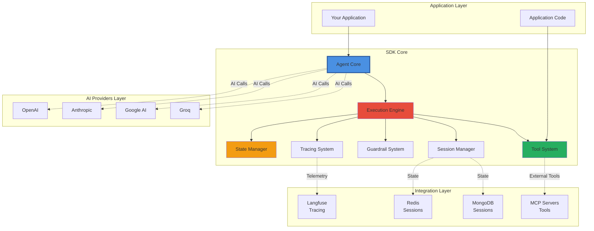

### Design Principles

1. **Provider Agnostic**: Works with any AI provider via Vercel AI SDK
2. **Modular**: Each component is independent and replaceable
3. **Observable**: Built-in tracing at every level
4. **Stateful**: Proper state management for complex workflows
5. **Parallel**: Automatic parallelization of independent operations
6. **Safe**: Multiple layers of validation and control

---

## 2. Core Components

### Component Diagram

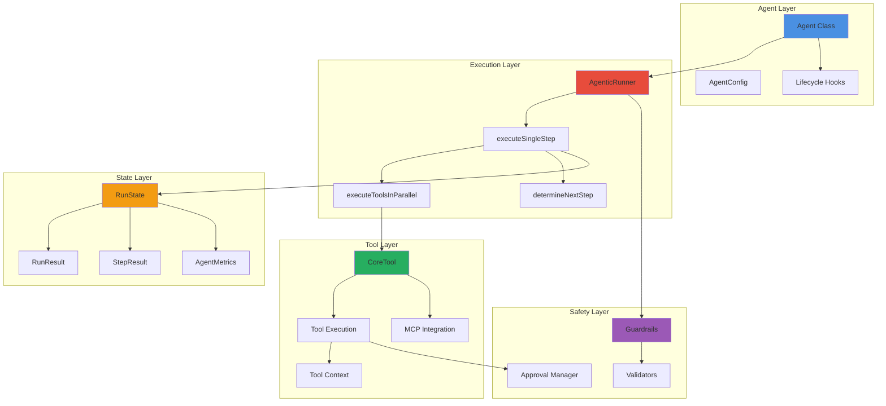

### Module Structure

```
src/
├── core/
│   ├── agent.ts              # Agent class & configuration
│   ├── execution.ts          # Parallel tool execution engine
│   ├── runner.ts             # Agentic execution runner
│   ├── runstate.ts           # State management
│   ├── result.ts             # Result types
│   ├── coordination.ts       # Multi-agent coordination
│   ├── race-agents.ts        # Parallel agent execution
│   ├── hitl.ts               # Human-in-the-loop patterns
│   └── approvals.ts          # Approval management
│
├── tools/
│   ├── image.ts              # Image generation
│   ├── audio.ts              # Audio transcription/TTS
│   ├── embedding.ts          # Embeddings
│   └── reranking.ts          # Document reranking
│
├── sessions/
│   ├── memory.ts             # In-memory sessions
│   ├── redis.ts              # Redis sessions
│   ├── database.ts           # MongoDB sessions
│   └── hybrid.ts             # Redis + MongoDB
│
├── guardrails/
│   └── index.ts              # All guardrail implementations
│
├── mcp/
│   ├── index.ts              # Standard MCP integration
│   ├── enhanced.ts           # Enhanced MCP with lifecycle
│   └── utils.ts              # MCP utilities
│
├── tracing/
│   ├── context.ts            # Tracing context management
│   ├── tracing.ts            # Custom tracing
│   └── tracing-utils.ts      # Tracing helpers
│
└── lifecycle/
    ├── events.ts             # Event types
    ├── langfuse/             # Langfuse integration
    └── index.ts              # Lifecycle hooks
```

---

## 3. Execution Engine

### Agentic Execution Flow

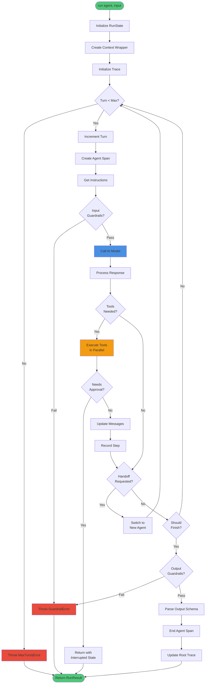

### Parallel Tool Execution

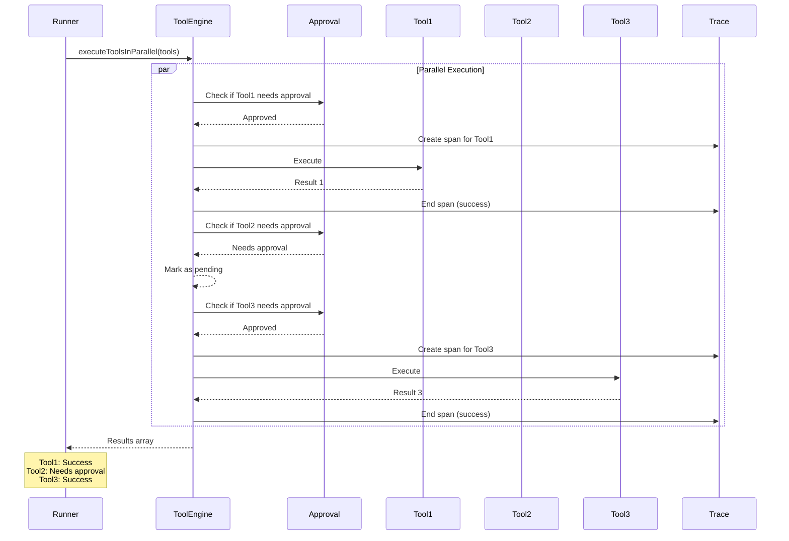

### Decision Making (determineNextStep)

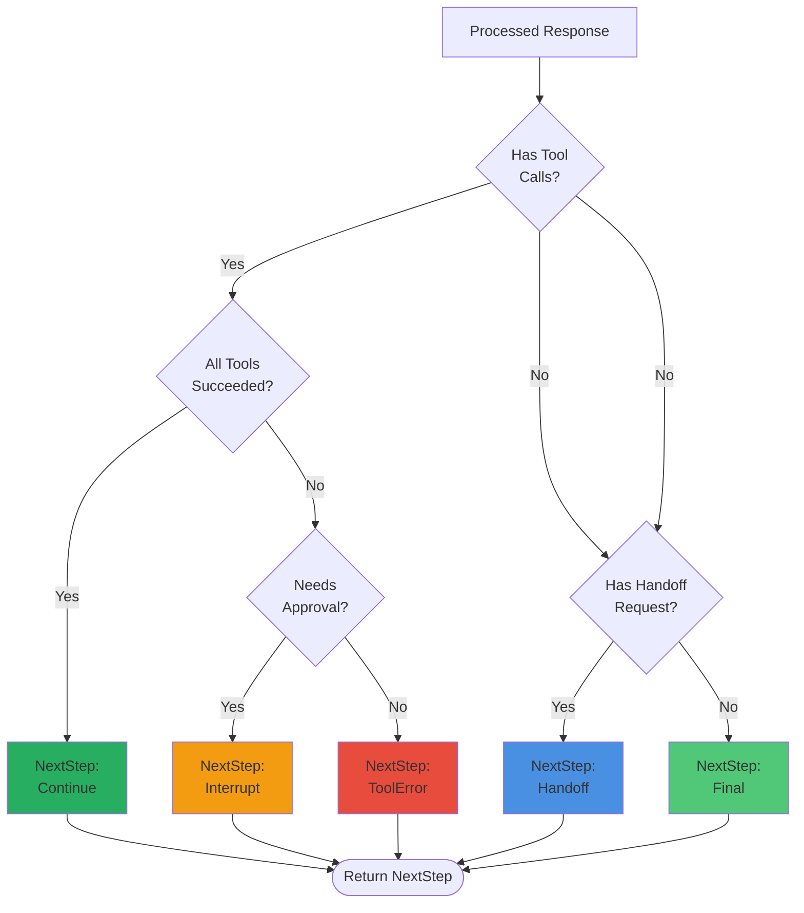

---

## 4. State Management

### RunState Architecture

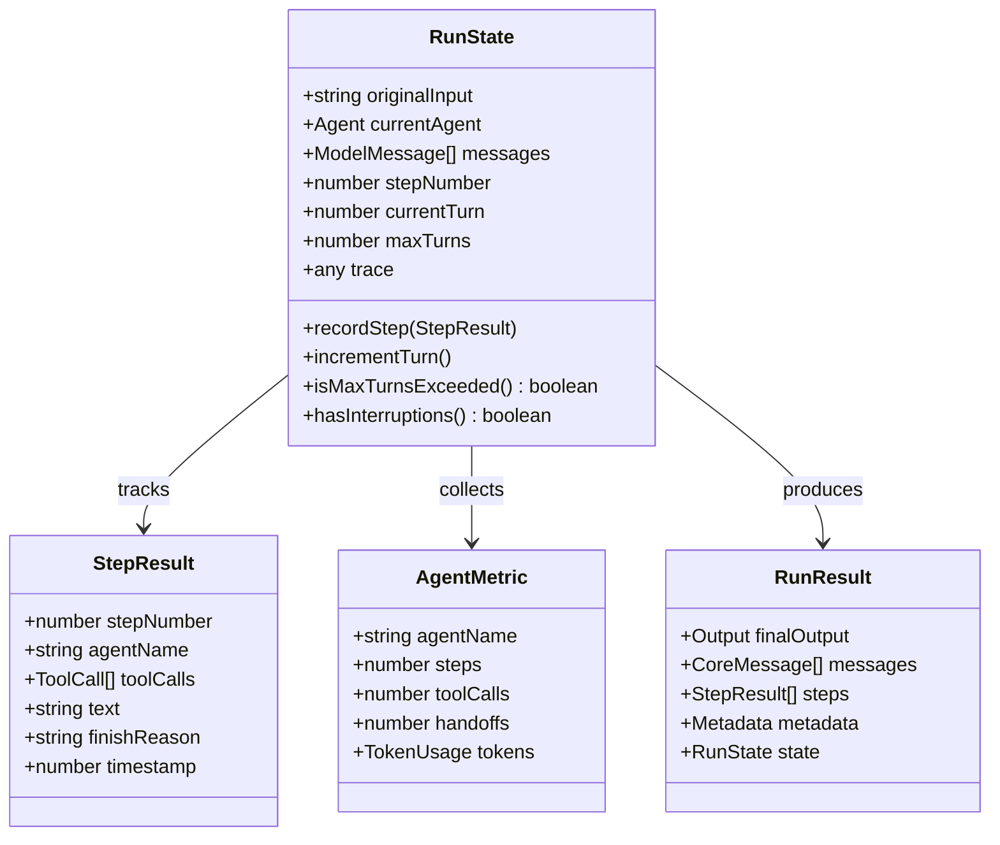

### State Transitions

```mermaid
stateDiagram-v2
    [*] --> Initializing: run(agent, input)
    
    Initializing --> Running: State created
    
    Running --> ToolExecution: Tools needed
    ToolExecution --> Running: Tools complete
    
    Running --> ApprovalRequired: Approval needed
    ApprovalRequired --> Interrupted: Save state
    Interrupted --> [*]: Return to caller
    
    [*] --> Running: Resume with state
    
    Running --> HandoffInitiated: Handoff requested
    HandoffInitiated --> Running: New agent active
    
    Running --> OutputValidation: Should finish
    OutputValidation --> Complete: Guardrails pass
    OutputValidation --> Failed: Guardrails fail
    
    Running --> Failed: Max turns exceeded
    Running --> Failed: Tool error
    
    Complete --> [*]: Return result
    Failed --> [*]: Throw error
    
    note right of Interrupted
        State saved externally
        Can be resumed later
    end note
    
    note right of HandoffInitiated
        Agent switches
        Context preserved
    end note
```

---

## 5. Tool System

### Tool Architecture

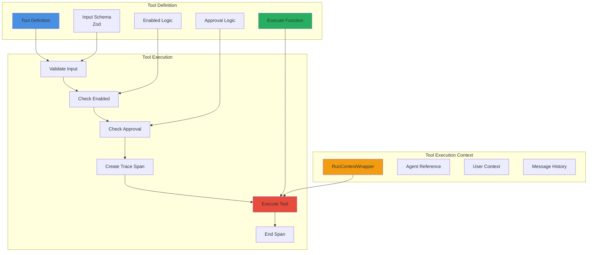

### MCP Integration

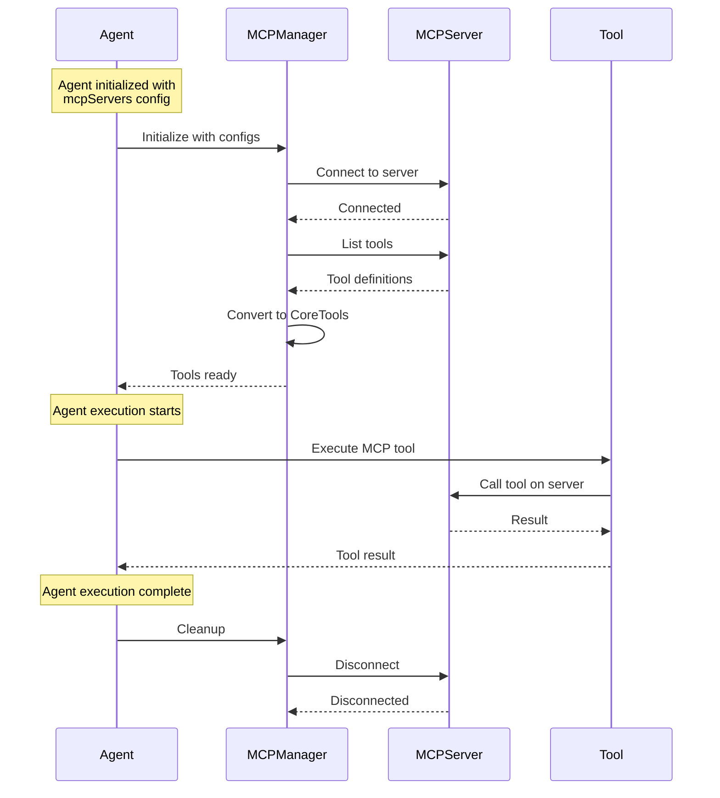

---

## 6. Multi-Agent Coordination

### Handoff Mechanism

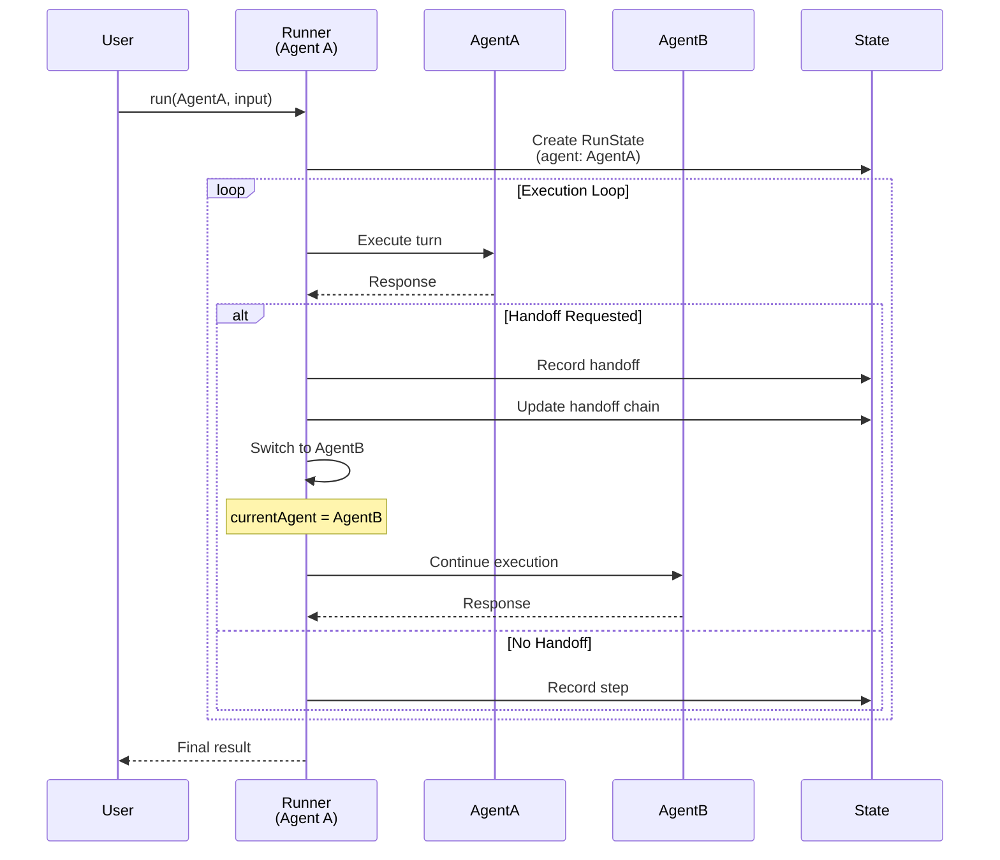

### Race Agents Pattern

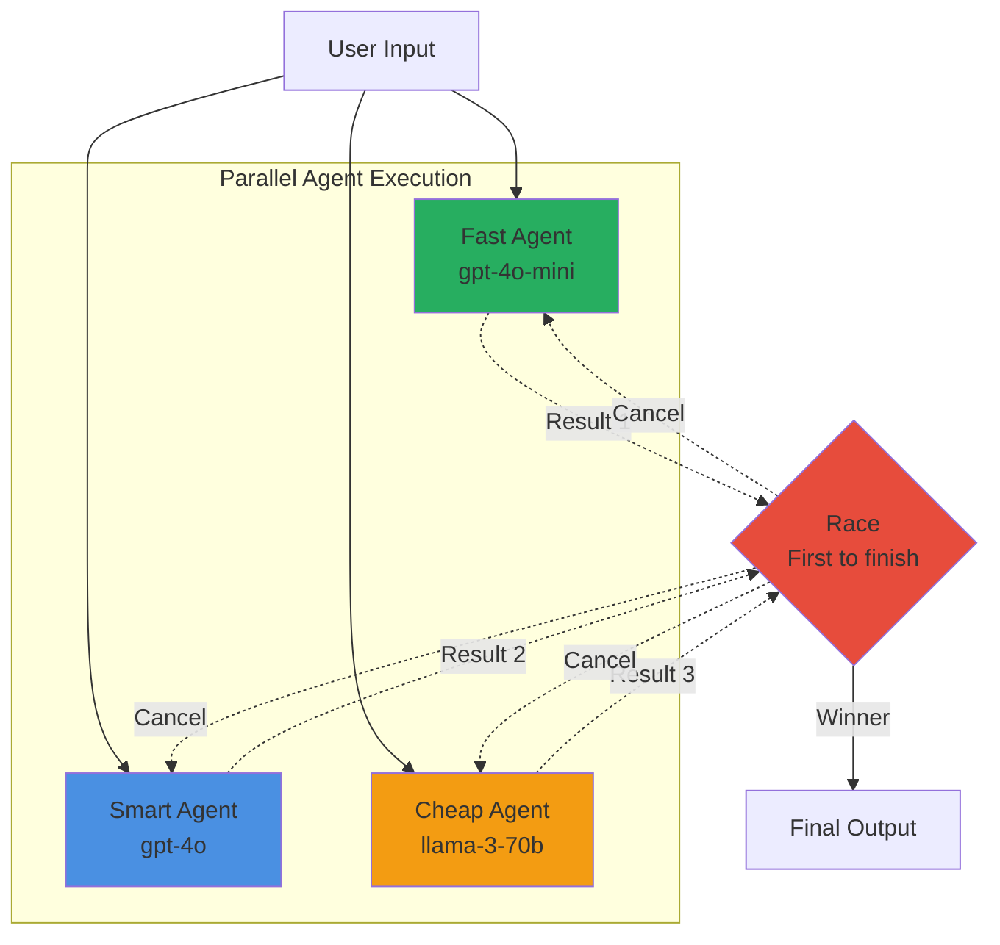

---

## 7. Integration Points

### External Integrations

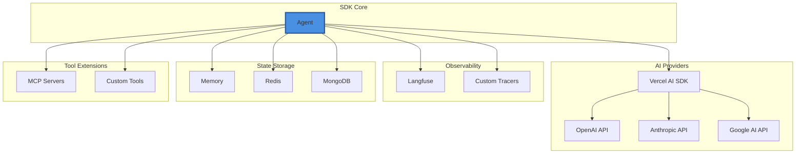

---

## 8. Data Flow

### Complete Request Flow

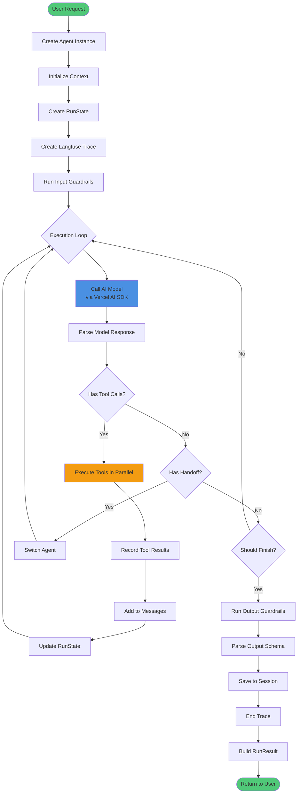

---

## 🎯 Key Architecture Decisions

### 1. Autonomous Execution
**Decision**: Agent-driven, not rule-based  
**Rationale**: True intelligence requires autonomy  
**Impact**: More powerful, flexible agents

### 2. Parallel by Default
**Decision**: Automatic tool parallelization  
**Rationale**: Maximize performance without complexity  
**Impact**: 3-10x faster execution

### 3. State-First Design
**Decision**: Comprehensive RunState management  
**Rationale**: Enable complex workflows (HITL, resumption)  
**Impact**: Support for advanced patterns

### 4. Provider Agnostic
**Decision**: Use Vercel AI SDK abstraction  
**Rationale**: Flexibility, no vendor lock-in  
**Impact**: Works with any provider

### 5. Observable by Default
**Decision**: Built-in tracing everywhere  
**Rationale**: Production debugging is critical  
**Impact**: Easy troubleshooting and optimization

---

## 📚 Related Documentation

- [Core Concepts](../guides/CORE_CONCEPTS.md) - Fundamental concepts
- [API Reference](./API.md) - Complete API documentation
- [Performance Guide](./PERFORMANCE.md) - Optimization strategies

---

**Made with ❤️ by [Tawk.to](https://www.tawk.to)**
