# 🏗️ Complete SDK Architecture & Flow

**Comprehensive end-to-end architecture aligned with source code v1.0.0**

---

## 📋 Table of Contents

- [System Overview](#system-overview)
- [Directory Structure](#directory-structure)
- [Core Architecture](#core-architecture)
- [Execution Flow](#execution-flow)
- [Multi-Agent Flow](#multi-agent-flow)
- [Guardrails Flow](#guardrails-flow)
- [Tracing & Observability](#tracing--observability)
- [Session Management](#session-management)
- [Tool Execution](#tool-execution)
- [Complete End-to-End Flow](#complete-end-to-end-flow)
- [Component Details](#component-details)

---

## 🎯 System Overview

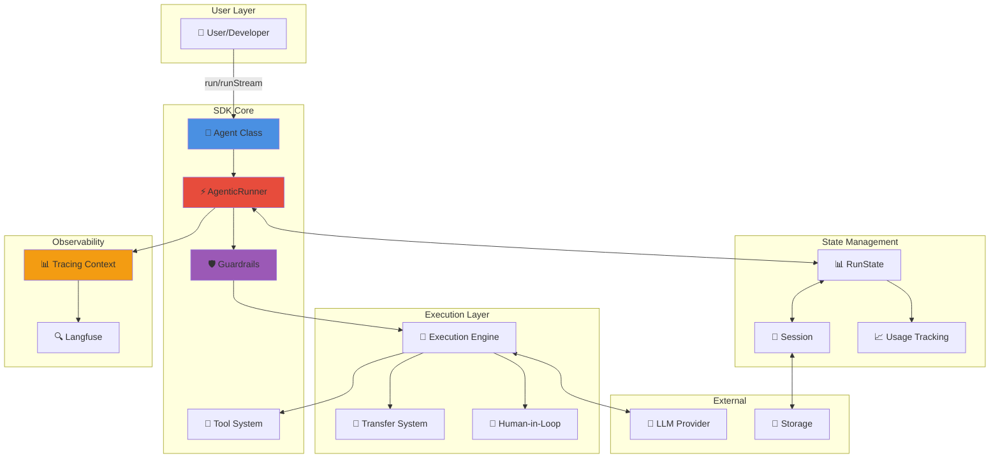

---

## 📁 Directory Structure

### Source Code Organization

```
src/
├── core/                       # Core execution engine
│   ├── agent/                 # Modular agent (types, class, run, tools)
│   ├── runner.ts              # AgenticRunner (main executor)
│   ├── execution.ts           # Single-step execution
│   ├── transfers.ts           # Multi-agent transfer system
│   ├── runstate.ts            # State management
│   ├── usage.ts               # Token tracking
│   ├── result.ts              # Result types
│   ├── approvals.ts           # HITL approvals
│   ├── coordination.ts        # Agent coordination
│   ├── race-agents.ts         # Race patterns
│   └── hitl.ts                # Human-in-the-loop
│
├── guardrails/                # Safety & validation
│   └── index.ts               # All guardrails
│
├── tracing/                   # Observability
│   ├── context.ts             # Tracing context
│   ├── tracing.ts             # Tracing logic
│   └── tracing-utils.ts       # Utilities
│
├── sessions/                  # State persistence
│   ├── session.ts             # Session interface
│   └── index.ts               # Exports
│
├── lifecycle/                 # Event system
│   ├── events.ts              # Hook definitions
│   └── langfuse/              # Langfuse integration
│       └── index.ts
│
├── tools/                     # Built-in tools
│   ├── audio/                 # Speech & transcription
│   ├── embeddings/            # Vector embeddings
│   ├── image/                 # Image generation
│   ├── rag/                   # RAG with Pinecone
│   └── rerank/                # Result reranking
│
├── helpers/                   # Utilities
│   ├── message.ts             # Message helpers
│   ├── safe-execute.ts        # Safe tool execution
│   └── toon.ts                # Token optimization
│
├── mcp/                       # Model Context Protocol
│   ├── index.ts               # MCP client
│   ├── enhanced.ts            # Enhanced features
│   └── utils.ts               # MCP utilities
│
├── approvals/                 # HITL system
│   └── index.ts               # Approval manager
│
├── types/                     # TypeScript types
│   ├── types.ts               # Core types
│   └── helpers.ts             # Type utilities
│
└── index.ts                   # Main exports
```

---

## 🏛️ Core Architecture

### Component Relationships

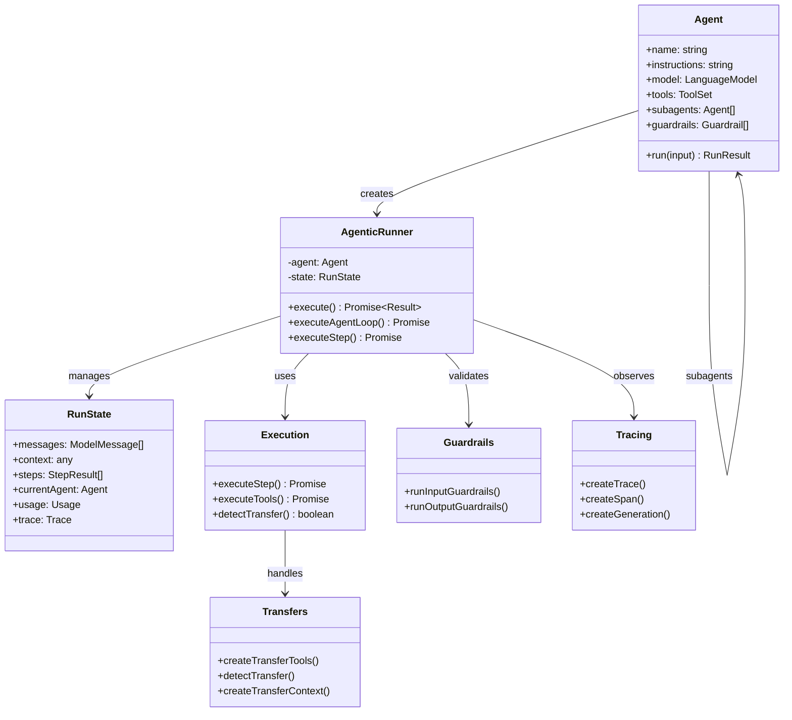

---

## ⚡ Execution Flow

### Main Execution Pipeline

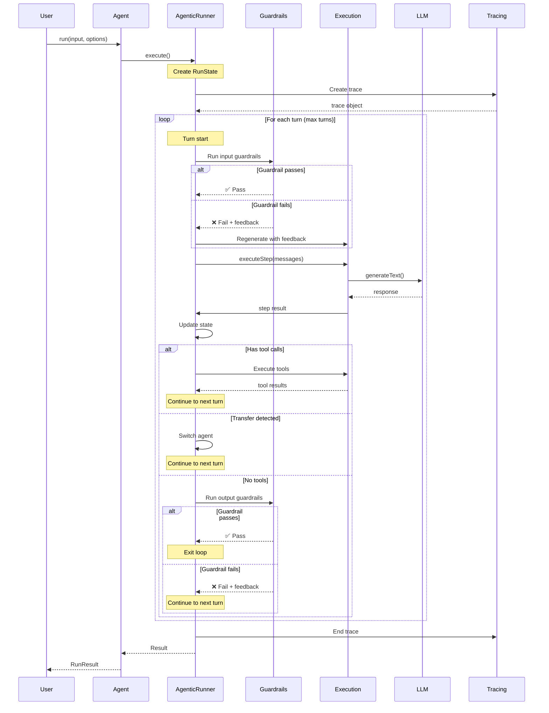

---

## 🔀 Multi-Agent Flow

### Agent Transfer & Coordination

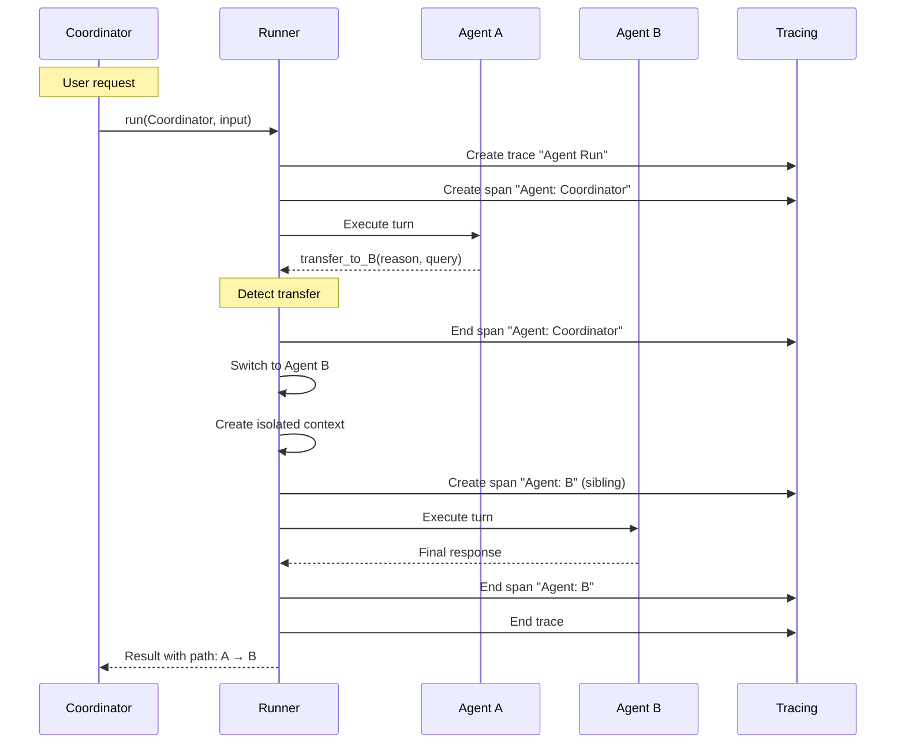

### Context Isolation

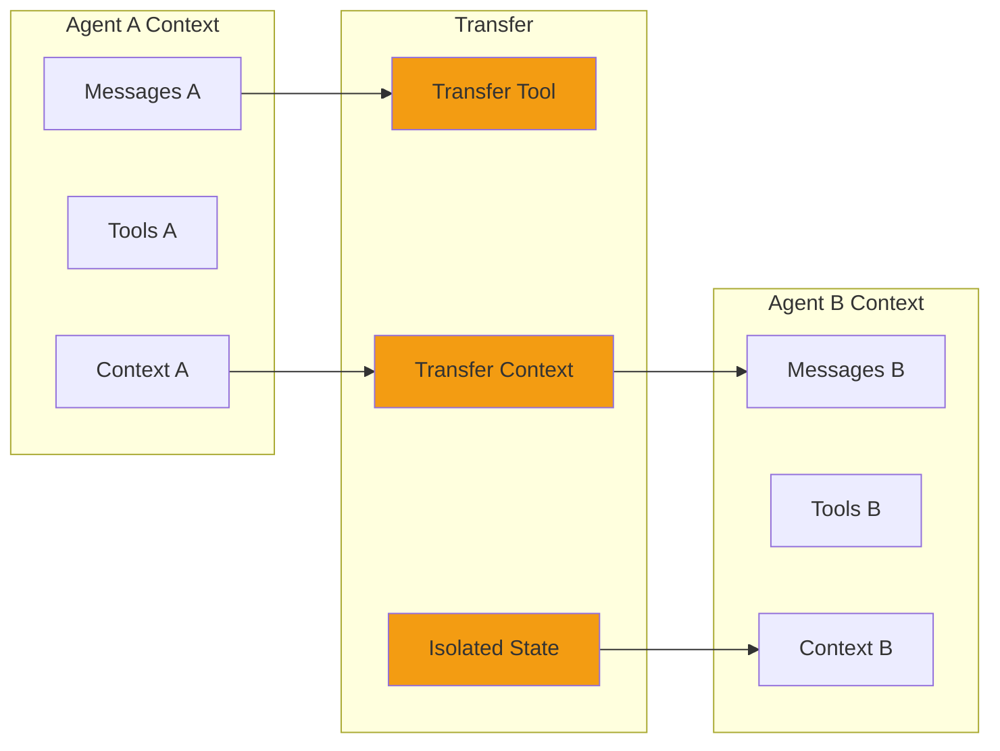

---

## 🛡️ Guardrails Flow

### Input & Output Validation

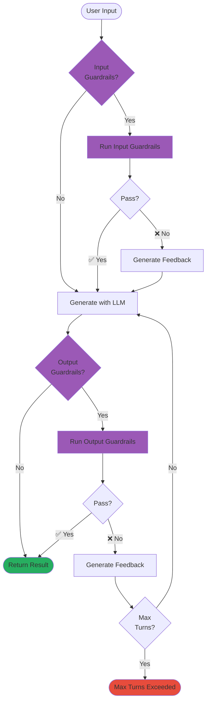

### Available Guardrails

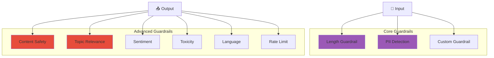

---

## 📊 Tracing & Observability

### Langfuse Integration

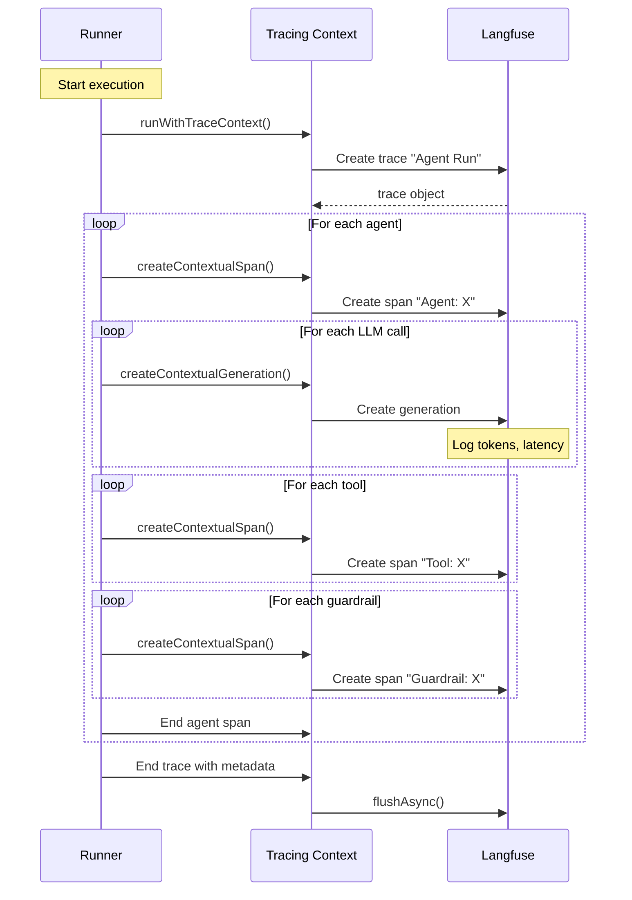

### Trace Hierarchy

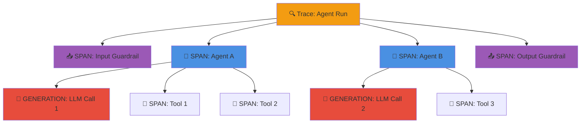

---

## 💾 Session Management

### Session Flow

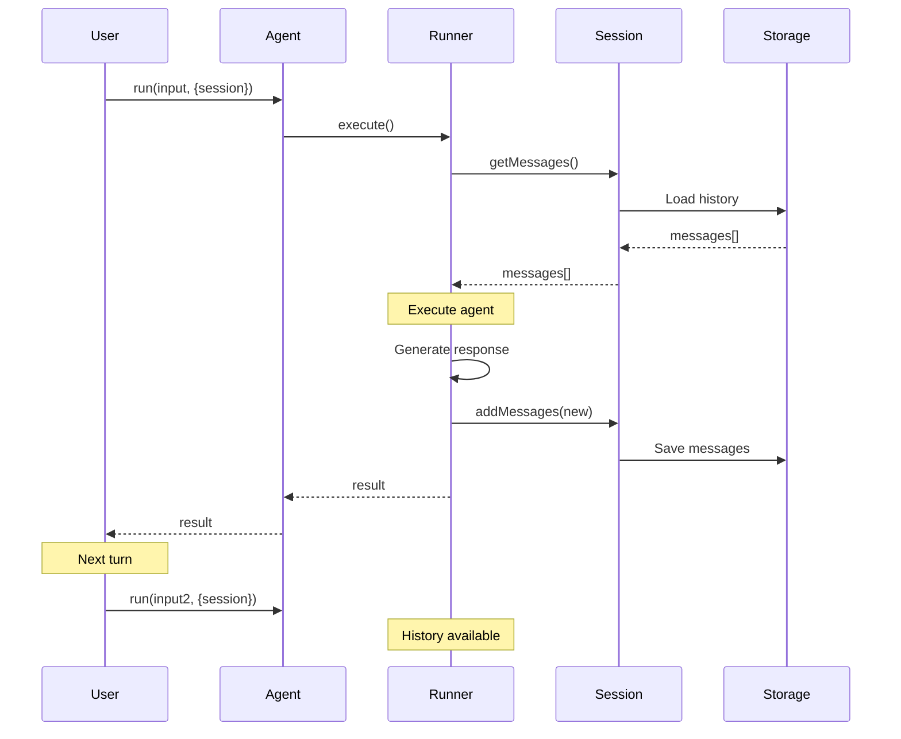

### Session Types

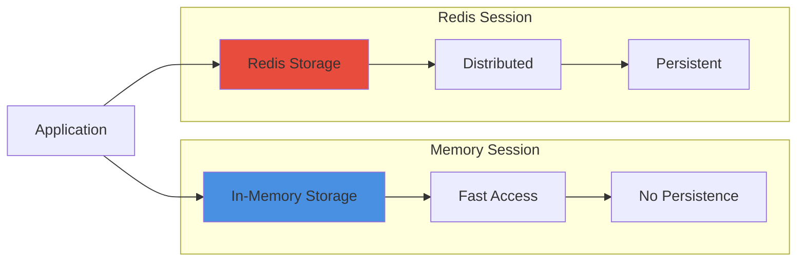

---

## 🔧 Tool Execution

### Tool Call Flow

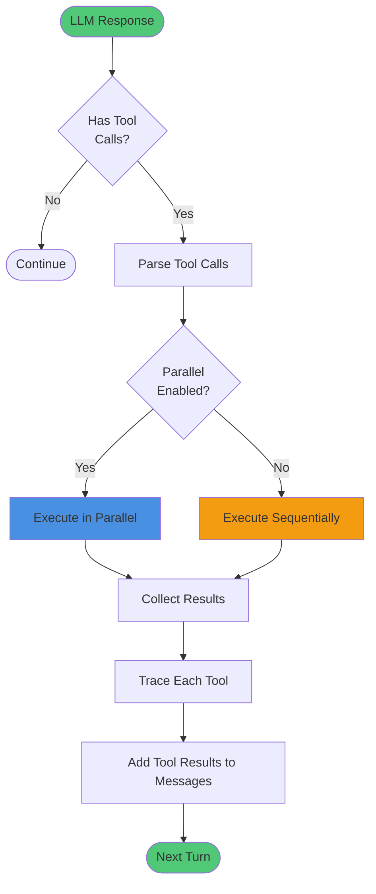

### Built-in Tools

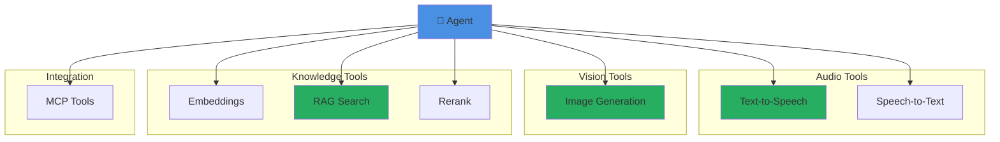

---

## 🎯 Complete End-to-End Flow

### Full System Flow with All Features

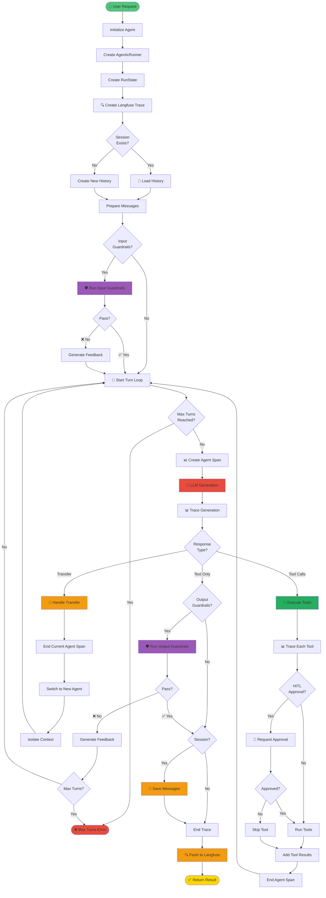

---

## 🔍 Component Details

### 1. Agent Class (`core/agent/agent-class.ts`)

**Purpose**: Main interface for creating and running agents

**Key Methods**:
- `run(input, options)` - Execute agent
- `runStream(input, options)` - Execute with streaming
- `tool(config)` - Create tool definition

**Key Properties**:
- `name` - Agent identifier
- `instructions` - System prompt
- `model` - LLM model
- `tools` - Tool definitions
- `subagents` - Child agents for transfers
- `guardrails` - Validation rules

### 2. AgenticRunner (`core/runner.ts`)

**Purpose**: Core execution engine

**Key Methods**:
- `execute()` - Main execution loop
- `executeAgentLoop()` - Agent turn loop
- `executeStep()` - Single LLM call
- `runInputGuardrails()` - Input validation
- `runOutputGuardrails()` - Output validation

**Features**:
- Turn-based execution
- Guardrail integration
- Transfer handling
- Tracing integration
- Token tracking

### 3. Execution Engine (`core/execution.ts`)

**Purpose**: Single-step execution logic

**Key Functions**:
- `executeStep()` - Execute one LLM call
- `executeToolCalls()` - Execute tools
- `detectTransfer()` - Check for transfers

### 4. Transfer System (`core/transfers.ts`)

**Purpose**: Multi-agent coordination

**Key Functions**:
- `createTransferTools()` - Generate transfer tools
- `detectTransfer()` - Detect transfer in response
- `createTransferContext()` - Isolate context

**Features**:
- Context isolation
- Transfer detection
- Query/reason passing

### 5. RunState (`core/runstate.ts`)

**Purpose**: State management during execution

**Properties**:
- `messages` - Conversation history
- `steps` - Execution steps
- `usage` - Token usage
- `currentAgent` - Active agent
- `transferChain` - Agent path
- `agentMetrics` - Per-agent stats

### 6. Guardrails (`guardrails/index.ts`)

**Available Guardrails**:
- `lengthGuardrail` - Text length validation
- `piiDetectionGuardrail` - PII detection
- `contentSafetyGuardrail` - Content safety (LLM-based)
- `topicRelevanceGuardrail` - Topic validation
- `sentimentGuardrail` - Sentiment analysis
- `toxicityGuardrail` - Toxicity check
- `languageGuardrail` - Language validation
- `rateLimitGuardrail` - Rate limiting

### 7. Tracing Context (`tracing/context.ts`)

**Purpose**: Langfuse integration

**Key Functions**:
- `withTrace()` - Create trace scope
- `createContextualSpan()` - Create span
- `createContextualGeneration()` - Create generation
- `runWithTraceContext()` - Execute with tracing

**Features**:
- Async context tracking
- Hierarchical spans
- Token tracking
- Error tracking

### 8. Session Manager (`sessions/`)

**Types**:
- `MemorySession` - In-memory storage
- `RedisSession` - Redis storage (external)

**Methods**:
- `getMessages()` - Load history
- `addMessage()` - Save message
- `clear()` - Clear history

### 9. Tool System (`tools/`)

**Built-in Tools**:
- Audio: Text-to-speech, transcription
- Embeddings: Vector generation
- Image: Image generation
- RAG: Pinecone search
- Rerank: Result reranking

### 10. Lifecycle Hooks (`lifecycle/`)

**Hook Events**:
- Agent hooks: `onStart`, `onEnd`, `onError`
- Run hooks: `onStepStart`, `onStepFinish`, `onToolCall`

---

## 📊 Data Flow Summary

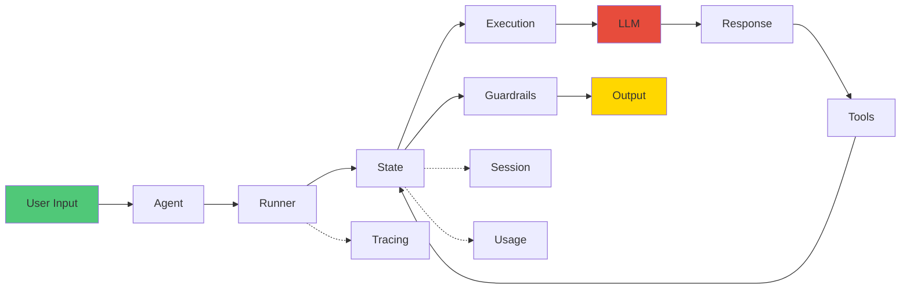

---

## ✅ Key Takeaways

1. **Agent** - User-facing interface
2. **AgenticRunner** - Core execution engine
3. **RunState** - Centralized state management
4. **Execution** - LLM interaction logic
5. **Transfers** - Multi-agent coordination
6. **Guardrails** - Safety & validation
7. **Tracing** - Observability via Langfuse
8. **Sessions** - Conversation persistence
9. **Tools** - Extensible functionality
10. **Lifecycle** - Event-driven hooks

---

**This architecture ensures:**
- ✅ Clear separation of concerns
- ✅ True agentic patterns
- ✅ Comprehensive observability
- ✅ Production-ready reliability
- ✅ Extensible design

---

**Made with ❤️ by [Tawk.to](https://www.tawk.to)**

