# 🔄 Complete Flow Documentation

**Understanding the tawk-agents-sdk execution flow with comprehensive sequence diagrams**

---

## Table of Contents

1. [Basic Agent Execution](#1-basic-agent-execution)
2. [Tool Calling Flow](#2-tool-calling-flow)
3. [Multi-Agent Transfer Flow](#3-multi-agent-transfer-flow)
4. [Guardrails Validation Flow](#4-guardrails-validation-flow)
5. [Langfuse Tracing Flow](#5-langfuse-tracing-flow)
6. [Session Management Flow](#6-session-management-flow)
7. [Complete End-to-End Flow](#7-complete-end-to-end-flow)

---

## 1. Basic Agent Execution

### Overview
The simplest agent execution - user input → model → response.

### Sequence Diagram


### Code Example

```typescript
import { Agent, run } from 'tawk-agents-sdk';
import { openai } from '@ai-sdk/openai';

const agent = new Agent({
  name: 'Assistant',
  model: openai('gpt-4o'),
  instructions: 'You are a helpful assistant.'
});

const result = await run(agent, 'Hello!');
console.log(result.finalOutput);
// Output: "Hello! How can I help you?"
```

---

## 2. Tool Calling Flow

### Overview
Agent decides to call a tool, executes it, and continues with the result.

### Sequence Diagram


### Parallel Tool Execution


### Code Example

```typescript
import { Agent, run, tool } from 'tawk-agents-sdk';
import { openai } from '@ai-sdk/openai';
import { z } from 'zod';

const calculator = tool({
  description: 'Perform arithmetic operations',
  inputSchema: z.object({
    operation: z.enum(['add', 'subtract', 'multiply', 'divide']),
    a: z.number(),
    b: z.number()
  }),
  execute: async ({ operation, a, b }) => {
    switch (operation) {
      case 'add': return a + b;
      case 'multiply': return a * b;
      // ... more operations
    }
  }
});

const agent = new Agent({
  name: 'Calculator',
  model: openai('gpt-4o'),
  tools: { calculator }
});

const result = await run(agent, 'What is 123 * 456?');
// Agent calls calculator tool, gets 56088, responds with formatted answer
```

---

## 3. Multi-Agent Transfer Flow

### Overview
Coordinator agent transfers work to specialist agents with context isolation.

### Sequence Diagram


### Transfer Flow Details


### Code Example

```typescript
import { Agent, run } from 'tawk-agents-sdk';
import { openai } from '@ai-sdk/openai';

// Specialist agent
const dataAnalyst = new Agent({
  name: 'DataAnalyst',
  model: openai('gpt-4o'),
  instructions: 'You analyze data and provide insights.',
  tools: { analyzeData: /* ... */ }
});

// Coordinator agent
const coordinator = new Agent({
  name: 'Coordinator',
  model: openai('gpt-4o'),
  instructions: 'Route tasks to specialist agents.',
  subagents: [dataAnalyst]  // Creates transfer_to_dataanalyst tool
});

const result = await run(coordinator, 'Analyze Q4 sales data');
// Flow: Coordinator → transfer_to_dataanalyst → Analyst analyzes → Back to Coordinator → Final response
```

---

## 4. Guardrails Validation Flow

### Overview
Input and output guardrails validate content before and after LLM generation.

### Sequence Diagram



```mermaid
sequenceDiagram
    participant U as User
    participant AR as AgenticRunner
    participant IG as Input Guardrails
    participant M as LLM
    participant OG as Output Guardrails
    participant T as Trace

    U->>AR: "User input with potential PII"
    
    T->>T: Create Span "Agent: Main"
    
    Note over IG: Input Validation
    T->>T: Create Span "Input Guardrails"
    AR->>IG: Validate input
    
    par Parallel Guardrail Checks
        IG->>IG: length_check (SPAN)
        IG->>IG: pii_detection (SPAN)
    end
    
    alt Input Valid
        IG-->>AR: All passed ✓
        T->>T: End Input Guardrails Span
        
        AR->>M: generateText()
        T->>T: Create GENERATION "LLM: Main"
        M-->>AR: Response
        T->>T: End GENERATION (with tokens)
        
        Note over OG: Output Validation
        T->>T: Create Span "Output Guardrails"
        AR->>OG: Validate output
        
        par Parallel Output Checks
            OG->>OG: length_check (SPAN)
            OG->>OG: pii_detection (SPAN)
            OG->>M: content_safety (GENERATION with tokens)
        end
        
        alt Output Valid
            OG-->>AR: All passed ✓
            T->>T: End Output Guardrails Span
            AR-->>U: Final response
        else Output Invalid
            OG-->>AR: Failed with feedback
            Note over AR: Retry with feedback
            AR->>M: Regenerate with guidance
            AR->>OG: Validate again
        end
        
    else Input Invalid
        IG-->>AR: Blocked ✗
        T->>T: End Input Guardrails Span (ERROR)
        AR-->>U: Input validation error
    end
    
    T->>T: End Agent Span
```

### Guardrail Types and Tracing


### Code Example

```typescript
import { Agent, run, lengthGuardrail, piiDetectionGuardrail, contentSafetyGuardrail } from 'tawk-agents-sdk';
import { openai } from '@ai-sdk/openai';

const agent = new Agent({
  name: 'SafeAgent',
  model: openai('gpt-4o'),
  instructions: 'You are a helpful, safe assistant.',
  guardrails: [
    // Input guardrails
    lengthGuardrail({
      type: 'input',
      maxLength: 1000,
      unit: 'characters'
    }),
    piiDetectionGuardrail({
      type: 'input',
      block: true
    }),
    
    // Output guardrails
    lengthGuardrail({
      type: 'output',
      maxLength: 2000
    }),
    piiDetectionGuardrail({
      type: 'output',
      block: true
    }),
    contentSafetyGuardrail({
      type: 'output',
      model: openai('gpt-4o-mini'),
      categories: ['violence', 'hate-speech']
    })
  ]
});

const result = await run(agent, 'User query');
// Flow: Input validation → LLM → Output validation → Response
```

---

## 5. Langfuse Tracing Flow

### Overview
Complete observability with hierarchical tracing of all agent operations.

### Trace Hierarchy


### Tracing Flow Sequence


### Code Example

```typescript
import { initLangfuse, Agent, run } from 'tawk-agents-sdk';
import { openai } from '@ai-sdk/openai';

// Initialize Langfuse (reads from env vars)
initLangfuse();

const agent = new Agent({
  name: 'TracedAgent',
  model: openai('gpt-4o'),
  instructions: 'You are helpful.'
});

const result = await run(agent, 'Hello!');

// Trace automatically sent to Langfuse with:
// - Trace ID
// - Agent spans (hierarchical)
// - LLM generations (with tokens)
// - Tool executions
// - Guardrail validations
// - Complete usage metrics
```

---

## 6. Session Management Flow

### Overview
Persistent conversation history with automatic summarization.

### Sequence Diagram


### Session Types


### Code Example

```typescript
import { Agent, run, MemorySession } from 'tawk-agents-sdk';
import { openai } from '@ai-sdk/openai';

const agent = new Agent({
  name: 'Assistant',
  model: openai('gpt-4o')
});

// Create session for user
const session = new MemorySession('user-123', 50);

// First interaction
const result1 = await run(agent, 'My name is Alice', { session });

// Second interaction - agent remembers
const result2 = await run(agent, 'What is my name?', { session });
// Response: "Your name is Alice"

// History automatically managed, summarized when needed
```

---

## 7. Complete End-to-End Flow

### Overview
All features working together in a production multi-agent system.

### Complete Sequence Diagram

```mermaid
sequenceDiagram
    participant U as User
    participant S as Session
    participant T as Trace
    participant C as Coordinator
    participant IG as Input Guards
    participant M1 as LLM (Coordinator)
    participant TR as Transfer
    participant SP as Specialist
    participant IG2 as Specialist Input Guards
    participant M2 as LLM (Specialist)
    participant Tool as Tool
    participant OG2 as Specialist Output Guards
    participant OG as Output Guards
    participant L as Langfuse

    U->>S: Query with session
    S-->>U: Load history
    
    U->>T: run(coordinator, query)
    T->>L: Create Trace "Agent Run"
    T->>T: Create Span "Agent: Coordinator"
    
    T->>IG: Validate input
    IG->>IG: Run all input guardrails
    IG-->>T: Passed ✓
    
    T->>M1: Create GENERATION
    M1->>M1: generateText()
    M1-->>T: ToolCall: transfer_to_specialist
    T->>T: End GENERATION (with tokens)
    
    TR->>TR: Filter context for isolation
    
    T->>T: Create Span "Agent: Specialist" (nested)
    
    T->>IG2: Validate specialist input
    IG2-->>T: Passed ✓
    
    T->>M2: Create GENERATION
    M2->>M2: generateText()
    M2-->>T: ToolCall: analyzeData
    T->>T: End GENERATION (with tokens)
    
    T->>Tool: Create Tool Span
    Tool->>Tool: Execute tool
    Tool-->>T: Result
    T->>T: End Tool Span
    
    M2->>M2: Continue with tool result
    M2-->>T: Final specialist response
    
    T->>OG2: Validate specialist output
    
    par Specialist Output Guardrails
        OG2->>OG2: length_check (SPAN)
        OG2->>M2: content_safety (GENERATION)
    end
    
    OG2-->>T: Passed ✓
    T->>T: End Specialist Span (with aggregated usage)
    
    TR-->>C: Transfer result
    M1->>M1: Synthesize final response
    
    T->>OG: Validate coordinator output
    OG-->>T: Passed ✓
    
    T->>T: End Coordinator Span (with total usage)
    
    T->>S: Store messages
    S-->>T: History updated
    
    T->>L: Flush trace (complete hierarchy)
    T->>T: End Trace
    
    T-->>U: RunResult with complete data
```



### Complete System Architecture


---

## Summary

### Key Flows

1. **Basic Execution**: User → Agent → LLM → Response
2. **Tool Calling**: Agent → Tool Call → Execute → Continue
3. **Multi-Agent**: Coordinator → Transfer → Specialist → Back → Final
4. **Guardrails**: Input Validation → Process → Output Validation
5. **Tracing**: Hierarchical spans tracking everything
6. **Sessions**: Persistent history with auto-summarization

### Tracing Hierarchy

```
Trace: Agent Run
└── Span: Agent: Coordinator
    ├── Span: Input Guardrails
    │   ├── Span: length_check
    │   └── Span: pii_detection
    ├── GENERATION: LLM: Coordinator (with tokens)
    ├── Span: Tool: calculator
    ├── Span: Agent: Specialist (nested)
    │   ├── Span: Input Guardrails
    │   ├── GENERATION: LLM: Specialist (with tokens)
    │   ├── Span: Tool: analyzeData
    │   └── Span: Output Guardrails
    │       ├── Span: length_check
    │       └── GENERATION: content_safety (with tokens)
    └── Span: Output Guardrails
```

### Production Ready

✅ **Complete observability** with Langfuse  
✅ **Safety** with guardrails  
✅ **Scalability** with multi-agent architecture  
✅ **Memory** with session management  
✅ **Performance** with parallel execution  
✅ **Reliability** with comprehensive error handling

---

**For more details, see:**
- [Getting Started](../getting-started/GETTING_STARTED.md)
- [Complete Architecture](./COMPLETE_ARCHITECTURE.md)
- [API Reference](./API.md)

